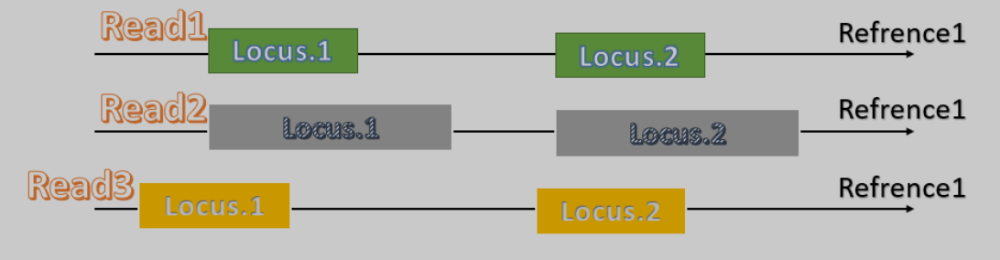

# Chimeara

## description

This is a chimeric alignment reporter. Chimeric alligments correspond to some structural variation in the sequenced sample in comparison to the reference genome.

The main element in this tool is the locus. A locus is defined by three properties:

- Chromosome
- Position
- Direction (0 for forward direction, 1 for reverse direction)

Therefor, this tool reports all reads that covers two distinct loci such as following:

#### Dependencies:

- Samtools
- gperf
- g++

## Input

- SAM file of the mapped sample
  - You will be prompted to either use the same hash function or to create a new one. You are supposed to create new hash function for different samples
  - Then, you will be prompted to enter the maximum allowed gap between reads to be considered on the same locus
  - Finally, you will be prompted to enter the the minimum number of supporting reads for each locus to be reported

## Output

- One text file named supported_loci.txt in the pipline_run directory following this template for each loci:

@$num_supporting_reads  $pos_1st_locus-$end_pos_1st_locus $pos_2nd_locus-$end_pos_2nd_locus

\>\>$1st_reference_name $1st_locus_direction

\>\>$2nd_reference_name $2nd_locus_direction

$read_line_supporting_1st_locus

$read_line_supporting_2nd_locus

$read_line_supporting_1st_locus

$read_line_supporting_2nd_locus

$read_line_supporting_1st_locus

$read_line_supporting_2nd_locus

## To run this pipeline use this line on a Linux terminal:

> ./pipeline_supported_chim_loci.sh $SAM_file_name.sam
